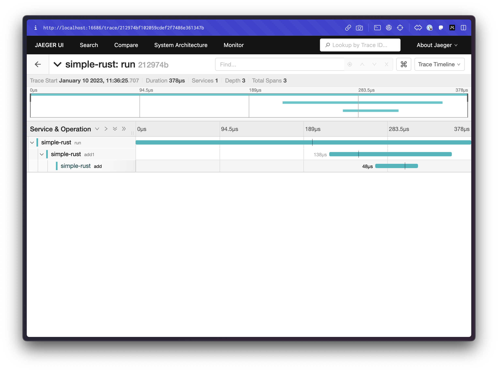
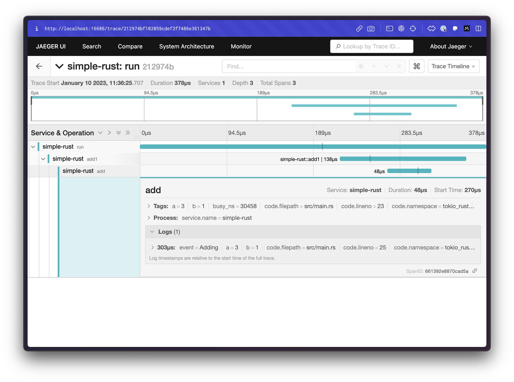
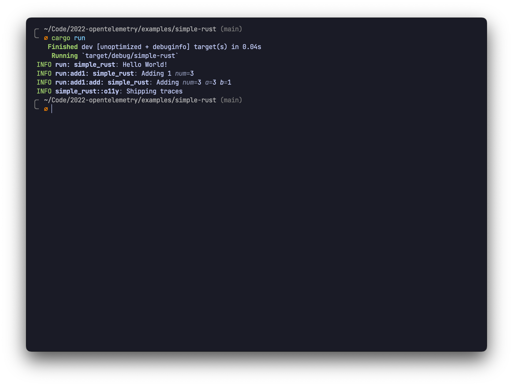

# simple-rust-tracing-jaeger

This example sets up a barebones app that uses [`tracing`](https://docs.rs/tracing) to create spans that are then exported to a Jaeger collector. Traces are also printed to stdout for quick access, albeit without the waterfall visualization.

To see this in action, first start up a Jaeger collector:

```sh
docker run -d -p6831:6831/udp -p6832:6832/udp -p16686:16686 -p14268:14268 jaegertracing/all-in-one:latest
```

Then run the app:

```
cargo run
```

Open up the Jaeger UI in your browser at [`http://localhost:16686`](http://localhost:16686). You'll find a service called `simple-rust` that you can find traces for. Here is what some of those traces might look like:




