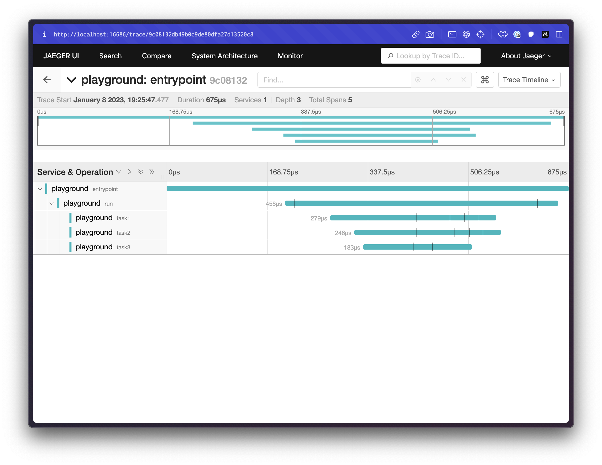
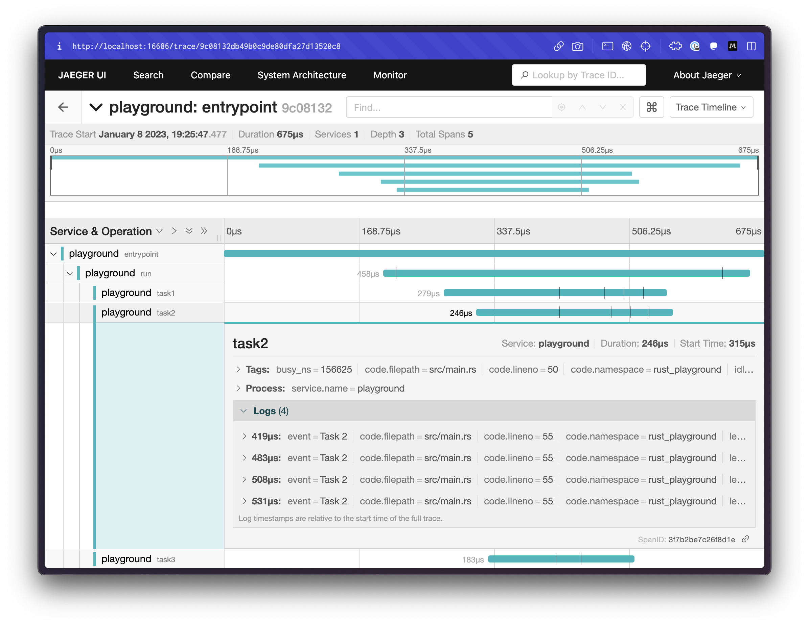
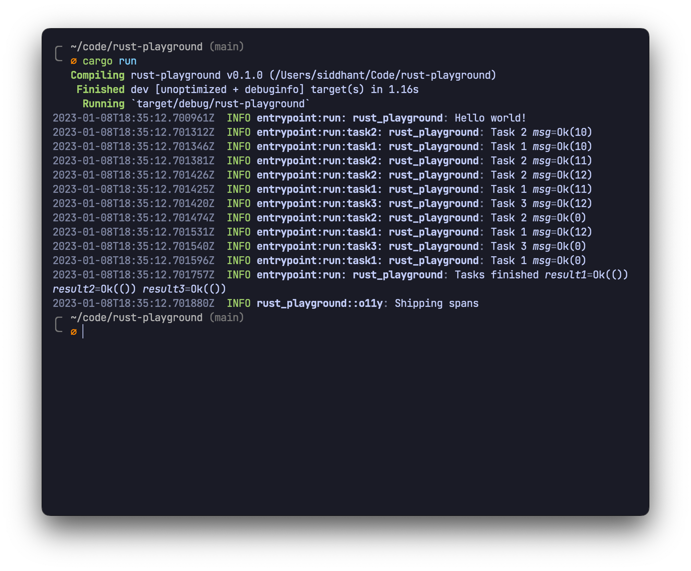

# tokio-rust-tracing-jaeger

This example sets up a Tokio-based app that uses [`tracing`](https://docs.rs/tracing) to create spans that are then exported to a Jaeger collector. Traces are also printed to stdout for quick access, albeit without the waterfall visualization.

It also hides all OpenTelemetry tracing behind a Cargo feature flag, so it can be stripped away if binary size is important (for example, when compiling in release mode)

To see this in action, first start up a Jaeger collector:

```sh
docker run -d -p6831:6831/udp -p6832:6832/udp -p16686:16686 -p14268:14268 jaegertracing/all-in-one:latest
```

Then run the app:

```sh
cargo run
```

Open up the Jaeger UI in your browser at [`http://localhost:16686`](http://localhost:16686). You'll find a service called `tokio-rust` that you can find traces for. Here is what some of those traces might look like:





If you want to build the project with all OTel stuff turned off (say for releases), you can disable the `otel` feature, which is on by default:

```sh
cargo build --no-default-features --release
```
